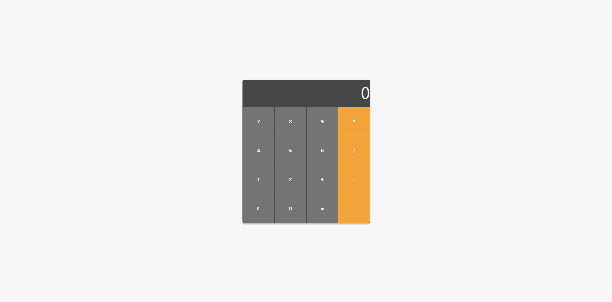

# ATIVIDADE 02 - Front End (Hugo)

Criar uma calculadora funcional, utilizando Java Script, para melhor aprendizagem.

## 🎥 Demonstração

## 🛠️ Construído com

Ferramentas e tecnologias utilizadas nesse projeto

- ✅ **HTML5** - Estruturação do site
- ✅ **CSS3** - Estilização e responsividade
- ✅ **JavaScript** - Funcionamento da calculadora
- ✅ **Bootstrap** - Agilidade e design intuitivo

## 📄 Licença

Este projeto está sob a licença (queiroz) - veja o arquivo [LICENSE](https://github.com/ferqueiroz/ATIV02-front-end/blob/main/LICENSE) para detalhes.

## 📩 Contato  

📧 **Email:** [ferqueiroz2205@gmail.com](mailto:ferqueiroz2205@gmail.com) 
📷 **Instagram:** [@_ferqueiroz](https://instagram.com/_ferqueiroz) 
👨‍💻 **GitHub:** [github.com/ferqueiroz](https://github.com/ferqueiroz)